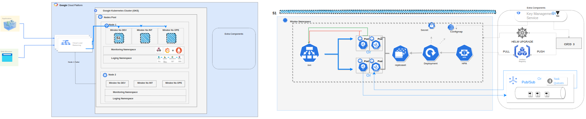
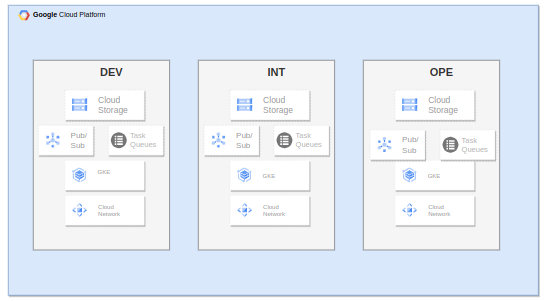
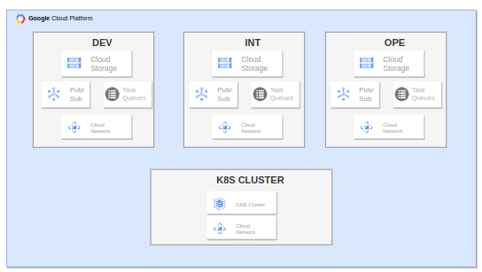
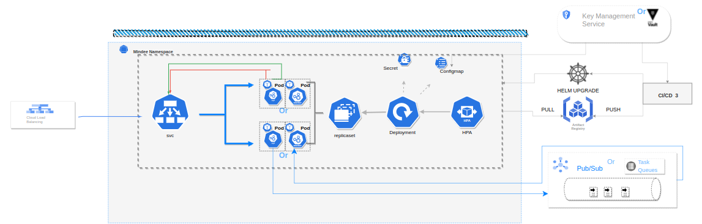
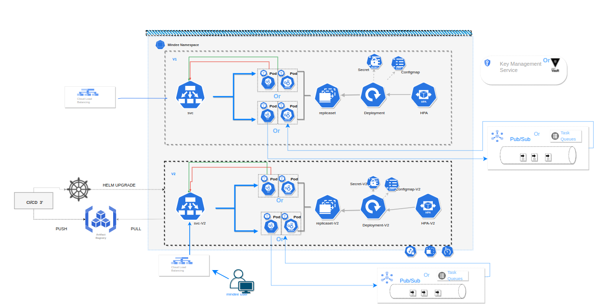
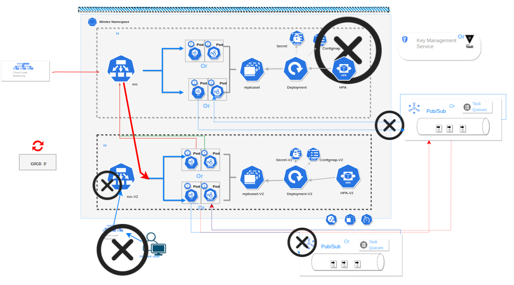
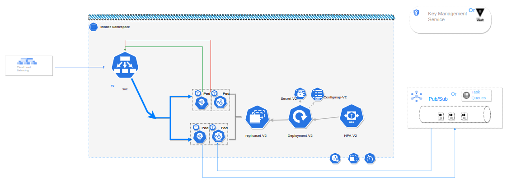

# [Mindee application](https://platform.mindee.com/)

A simple overview of use/purpose. In some use cases, I had two suggestions, so
You can find model1/model2 in which both suggestions were developed. Also, some
extra components/features can be added, which you will find with `extra`.

## Description

Design of an MVP architecture based on Microservice architecture

## Plan
* General overview
* Architecture
    1. Environment 
       1.1.Model 1
       1.2.Model 2
    2. System components
    3. Test upgrade and traffic load switching 
       3.1.Model 1
       3.2.Model 2
    4. Provisioning
    5. Security
    6. Scalability
* Extra components

## General Overview

In this picture, you can find the global architecture in one cluster deployed in
GKE. 

## Architecture

To have more options, I created two different environment suggestions that I
will describe each:

### Environment

#### Model 1 

 In this model, each environment DEV, INT, and OPE will be in a separate
 cluster. It will be a more secure and stable infrastructure, yet it will cost
more. 

#### Model 2 

In this model, all the environments will be in the same cluster, here we can
risk the security and stability since they share the same components, yet it
will be cheaper. 

### System components

 **Whatever chosen model, here is what we will have in our system:** 

Our cluster will have `3 nodes` to ensure node tolerance, in case a node is
dead, the other will be available to load traffic. In the node, we will have 2
deployments with a `rolling update` strategy: one for the worker and the other
for the API REST. **PS: in the image, only one deployment exists for a better
and clear design yet was considered in the pods)** Choosing deployment was for
our need for `replica sets`. Replicates will ensure the same number of running
pods. By that we are sure *we will always have the same load*. In addition, a
`config map` and a `secret` were added to secure the passwords in case needed
and the service accounts.

Our deployment will be able to communicate with the exterior through a `service
` type Loadbalancer, to keep the HA of the cluster.

### Test upgrade and traffic load switching

#### Model 1:

here we will only change the image version through the CI/CD pipeline ( docker
image version ) since it will be already tested in both env DEV and INT So here
we will have the same model always (shown in the picture) so no need to create
any new components like the BLUE GREEN architecture would.

#### Model 2: 

 Here we will create a new deployment with the new image
in the same cluster and same namespace. So now we will have new components such
as a new service, HPA, and a new deployment. Also, the system will record other
new components like the pubsub. For that definitely, a new CI/CD pipeline will
be used to make all of the creation take place. After our deployment is created,
we should test the traffic and the application. Once everything is okay, we will
switch the traffic load to the previously created deployment. ( involvement of
another CI/CD pipeline)

Once the traffic has been switched, we need to make sure to delete some
components: the new pubsub, the new service, and the LB but we will keep the
deployment in case of rollback need 

### Provisioning

For provisioning, several CI/CD pipelines will be used :

 * Create the infrastructure environment with a Terraform script
 * Create the required namespaces, and the monitoring and logging components.
 * Create and deploy mindee application

 In case of choice 2 for test upgrade and traffic load switching * Create a new
    deployment with a new version * Load the traffic and delete unused
    components (in case of choice 2 for test upgrade and traffic load switching)
    * Rollback * Delete the deployment after ensuring that the release is stable 

### security

To ensure the security of our application, GCP has a great security system,
which we take advantage of by creating:

* Network policies
* RBAC
* namespace quota

for extra security, we can add a vault( security server in which we have our
secrets) or a GCP secret manager.

### Scalibility 

Apply Horizontal pod autoscaling (HPA) in the application deployment to ensure
scalability of the pods.

For extra scalability also, we can create a webhook from the monitoring
deployment to add a new node pool in case of a shortage of resources and space.

### Broker usage

`Pub/sub` or  `Cloud task queue` can be used as a message broker service to
handle asynchronous tasks. I chose them because of the high availability (HA)
and it is managed by Google.

## Extra Components

Logging services as `Prometheus` to collect metrics and logs in case of failure
or error in the API or worker Monitoring services such as Grafana to check the
cluster state with clear dashboards and figures. `LB` service type could be
   changed to `ingress`, why would we need to? In case we use the second model
for the environment (same cluster for 3 env), we will need to create 3 LB, one
LB for each environment to make sure that the traffic loading to the different
namespace(ns)/ deployment will not fail. In case of a Huge size of documents, we
can use a GCS to store the documents,  the GCS will trigger the pub/sub that can
trigger the worker.
